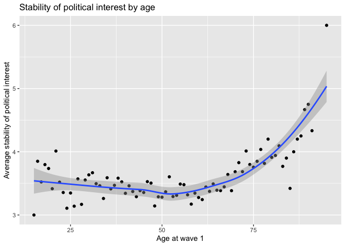

Statistical assignment 3
================
\[Youran Xu\] \[098252\]
\[Feb. 16th, 2020\]

In this assignment we will explore political interest (*vote6*) and how
it changes over time.

## Read data

First we want to read and join the data for the first 7 waves of the
Understanding Society. (Wave 8 does not have a variable for political
interest). We only want five variables: personal identifier, sample
origin, sex, age and political interest. It is tedious to join all the
seven waves manually, and it makes sense to use a loop in this case.
Since you don’t yet know about iteration I’ll provide the code for you;
please see the explanation of the code here:
<http://abessudnov.net/dataanalysis3/iteration.html>.

The only thing you need to do for this code to work on your computer is
to provide a path to the directory where the data are stored on your
computer.

``` r
library(tidyverse)
library(data.table)

# data.table is faster compared to readr so we'll use it in this case (the function fread()). You need to install this package first to be able to run this code.

# create a vector with the file names and paths

files <- dir(
             # Select the folder where the files are stored.
             "/Users/youran/Data3-2020/data/UKDA-6614-tab/tab",
             # Tell R which pattern you want present in the files it will display.
             pattern = "indresp",
             # We want this process to repeat through the entire folder.
             recursive = TRUE,
             # And finally want R to show us the entire file path, rather than just
             # the names of the individual files.
             full.names = TRUE)

# Select only files from the UKHLS.
files <- files[stringr::str_detect(files, "ukhls")]
files
```

    ## [1] "/Users/youran/Data3-2020/data/UKDA-6614-tab/tab/ukhls_w1/a_indresp.tab"
    ## [2] "/Users/youran/Data3-2020/data/UKDA-6614-tab/tab/ukhls_w2/b_indresp.tab"
    ## [3] "/Users/youran/Data3-2020/data/UKDA-6614-tab/tab/ukhls_w3/c_indresp.tab"
    ## [4] "/Users/youran/Data3-2020/data/UKDA-6614-tab/tab/ukhls_w4/d_indresp.tab"
    ## [5] "/Users/youran/Data3-2020/data/UKDA-6614-tab/tab/ukhls_w5/e_indresp.tab"
    ## [6] "/Users/youran/Data3-2020/data/UKDA-6614-tab/tab/ukhls_w6/f_indresp.tab"
    ## [7] "/Users/youran/Data3-2020/data/UKDA-6614-tab/tab/ukhls_w7/g_indresp.tab"
    ## [8] "/Users/youran/Data3-2020/data/UKDA-6614-tab/tab/ukhls_w8/h_indresp.tab"
    ## [9] "/Users/youran/Data3-2020/data/UKDA-6614-tab/tab/ukhls_w9/i_indresp.tab"

``` r
# create a vector of variable names
vars <- c("memorig", "sex_dv", "age_dv", "vote6")

for (i in 1:7) {
        # Create a vector of the variables with the correct prefix.
        varsToSelect <- paste(letters[i], vars, sep = "_")
        # Add pidp to this vector (no prefix for pidp)
        varsToSelect <- c("pidp", varsToSelect)
        # Now read the data. 
        data <- fread(files[i], select = varsToSelect)
        if (i == 1) {
                all7 <- data  
        }
        else {
                all7 <- full_join(all7, data, by = "pidp")
        }
        # Now we can remove data to free up the memory.
        rm(data)
} 
```

## Reshape data (20 points)

Now we have got the data from all 7 waves in the same data frame
**all7** in the wide format. Note that the panel is unbalanced, i.e. we
included all people who participated in at least one wave of the survey.
Reshape the data to the long format. The resulting data frame should
have six columns for six variables.

``` r
Long <- all7 %>%
  gather(a_memorig : g_vote6, key = "variable", value = "value") %>% 
  separate(variable, into = c("wave", "variable"), sep = "_", extra = "merge") %>% 
  spread(key = variable, value = value)
```

## Filter and recode (20 points)

Now we want to filter the data keeping only respondents from the
original UKHLS sample for Great Britain (memorig == 1). We also want to
clean the variables for sex (recoding it to “male” or “female”) and
political interest (keeping the values from 1 to 4 and coding all
negative values as missing). Tabulate *sex* and *vote6* to make sure
your recodings were correct.

``` r
table(Long$sex_dv)
```

    ## 
    ##     -9      0      1      2 
    ##      5     17 153852 180641

``` r
table(Long$vote6)
```

    ## 
    ##    -10     -9     -7     -2     -1      1      2      3      4 
    ##   4615    366  24725    431    358  30903 102110  86712  84295

``` r
Long <- Long %>%
        filter(memorig == 1) %>%
        mutate(sex_dv = ifelse(sex_dv == 1, "male", 
                               ifelse(sex_dv == 2, "female", NA))) %>%
        mutate(vote6 = ifelse(vote6 > 0, vote6, NA))

Long %>%
  pull(sex_dv) %>% 
  table()
```

    ## .
    ## female   male 
    ## 117665 100342

``` r
Long %>%
  pull(vote6) %>% 
  table()
```

    ## .
    ##     1     2     3     4 
    ## 21660 70952 56134 52145

## Calculate mean political interest by sex and wave (10 points)

Political interest is an ordinal variable, but we will treat it as
interval and calculate mean political interest for men and women in each
wave.

``` r
meanVote6 <- Long %>%
  filter(!is.na(sex_dv)) %>% 
  group_by(sex_dv, wave, add = TRUE) %>% 
  summarise(meanVote = mean(vote6, na.rm = TRUE)
    
  )
        
meanVote6
```

    ## # A tibble: 14 x 3
    ## # Groups:   sex_dv [2]
    ##    sex_dv wave  meanVote
    ##    <chr>  <chr>    <dbl>
    ##  1 female a         2.84
    ##  2 female b         2.82
    ##  3 female c         2.87
    ##  4 female d         2.89
    ##  5 female e         2.87
    ##  6 female f         2.81
    ##  7 female g         2.73
    ##  8 male   a         2.53
    ##  9 male   b         2.51
    ## 10 male   c         2.54
    ## 11 male   d         2.55
    ## 12 male   e         2.51
    ## 13 male   f         2.47
    ## 14 male   g         2.42

## Reshape the data frame with summary statistics (20 points)

Your resulting data frame with the means is in the long format. Reshape
it to the wide format. It should look like this:

| sex\_dv | a | b | c | d | e | f | g |
| ------- | - | - | - | - | - | - | - |
| female  |   |   |   |   |   |   |   |
| male    |   |   |   |   |   |   |   |

In the cells of this table you should have mean political interest by
sex and wave.

Write a short interpretation of your findings.

``` r
library(reshape2)
meanVote6 %>% 
  melt(id = c("wave", "sex_dv")) %>% 
   unite("variable", c("wave")) %>% 
   dcast(sex_dv ~ variable)
```

    ##   sex_dv        a        b        c        d        e        f        g
    ## 1 female 2.839437 2.816370 2.874985 2.887006 2.865092 2.807873 2.728400
    ## 2   male 2.527112 2.512143 2.544448 2.551704 2.507875 2.472188 2.415998

``` r
# In general, women have lower political interest (shown by higher score) than men. For both genders, a trend can be spotted that people became less and less interested in politics until wave 4 (2012-2014) and became increasingly interested afterwards.
```

## Estimate stability of political interest (30 points)

Political scientists have been arguing how stable the level of political
interest is over the life course. Imagine someone who is not interested
in politics at all so that their value of *vote6* is always 4. Their
level of political interest is very stable over time, as stable as the
level of political interest of someone who is always very interested in
politics (*vote6* = 1). On the other hand, imagine someone who changes
their value of *votes6* from 1 to 4 and back every other wave. Their
level of political interest is very unstable.

Let us introduce a measure of stability of political interest that is
going to be equal to the sum of the absolute values of changes in
political interest from wave to wave. Let us call this measure Delta. It
is difficult for me to typeset a mathematical formula in Markdown, but
I’ll explain this informally.

Imagine a person with the level of political interest that is constant
over time: {1, 1, 1, 1, 1, 1, 1}. For this person, Delta is zero.

Now imagine a person who changes once from “very interested in politics”
to “fairly interested in politics”: {1, 1, 1, 1, 2, 2, 2}. For them,
Delta = (1 - 1) + (1 - 1) + (1 - 1) + (2 - 1) + (2 - 2) + (2 - 2) = 1.

Now imagine someone who changes from “very interested in politics” to
“not at all interested” every other wave: {1, 4, 1, 4, 1, 4, 1}. Delta
= (4 - 1) + abs(1 - 4) + (4 - 1) + abs(1 - 4) + (4 - 1) + abs(1 - 4) = 3
\* 6 = 18.

Large Delta indicates unstable political interest. Delta = 0 indicates a
constant level of political interest.

Write the R code that does the following.

1.  To simplify interpretation, keep only the respondents with
    non-missing values for political interest in all seven waves.
2.  Calculate Delta for each person in the data set.
3.  Calculate mean Delta for men and women.
4.  Calculate mean Delta by age (at wave 1) and plot the local
    polynomial curve showing the association between age at wave 1 and
    mean Delta. You can use either **ggplot2** or the *scatter.smooth()*
    function from base R.
5.  Write a short interpretation of your findings.

<!-- end list -->

``` r
#### Q1 ####
Delta <- Long %>% 
   melt(id = c("wave", "pidp")) %>% 
   unite("variable", c("wave", "variable"), sep = "_") %>% 
   dcast(pidp ~ variable) %>% 
   filter(!is.na(a_vote6) & 
            !is.na(b_vote6) &
            !is.na(c_vote6) &
            !is.na(d_vote6) &
            !is.na(e_vote6) &
            !is.na(f_vote6) &
            !is.na(g_vote6)) %>% 
  gather(a_age_dv:g_vote6, key = "variables", value = "value") %>% 
  separate(variables, into = c("wave", "variable"), sep = "_", extra = "merge") %>%
  spread(key = variable, value = value)

#### Q2 ####
Delta <- Delta %>% 
   mutate(diff = abs(as.numeric(vote6) - lag(as.numeric(vote6), 1))) %>% 
   group_by(pidp) %>% 
   mutate(Delta = sum(diff, na.rm = TRUE))
  
#### Q3 ####
 Delta %>% 
   filter(!is.na(sex_dv)) %>% 
   group_by(sex_dv) %>% 
   summarise(
     MeanByGender = mean(Delta, na.rm = TRUE)
   )
```

    ## # A tibble: 2 x 2
    ##   sex_dv MeanByGender
    ##   <chr>         <dbl>
    ## 1 female         3.46
    ## 2 male           3.47

``` r
#### Q4 ####
Age <- Delta %>% 
   group_by(age = age_dv[wave == "a"]) %>% 
   summarise(
     MeanByAge = mean(Delta, na.rm = TRUE)
   )
Age %>% 
   ggplot(aes(x = as.numeric(age), y = MeanByAge)) +
   geom_point() +
   geom_smooth() +
   xlab("Age at wave 1") +
   ylab("Average stability of political interest") +
   ggtitle("Stability of political interest by age")
```

<!-- -->

#### Q5

As shown by the table, there is only very slight difference in the
stability of political interest between men and women, with women
slightly more stable than men.

As for age groups, political interest remains relatively stable (with
delta of around 3.5) till the age of 65, when political interest becomes
less stable as age goes up.
